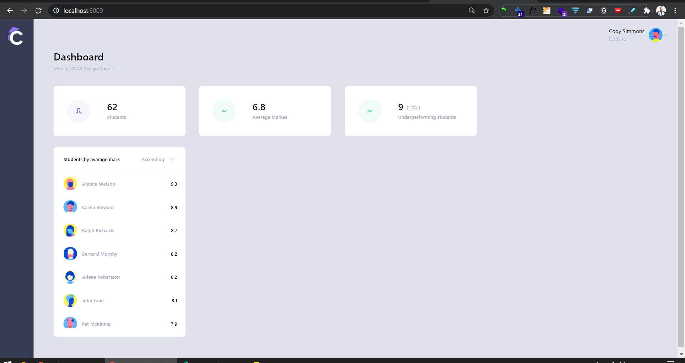

# React Course Dashboard



### Basic usage:
#### 
```
$ yarn
$ yarn start
```

### Mock up and API details
- [UI Figma](https://www.figma.com/proto/nV7wbfWA7aatuC34HjnrkG/Course-Dashboard?node-id=0%3A1)
- [Dashboard API](http://my-json-server.typicode.com/shripad-agashe/fake-api/dashboard)
- [Student API](http://my-json-server.typicode.com/shripad-agashe/fake-api/students)

### TODO:
- Error handling
    - API error case by using at-least a toast message.
- Unit Test
    - Unit test case for axios api calls.
    - Unit test case for useState, useEffect etc.
    - Exhaustive unit test cases.
- Write PropsType